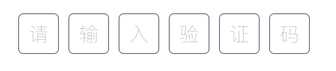
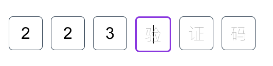
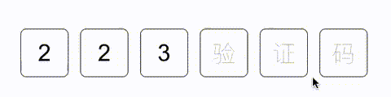

### 验证码输入框组件

#### 未输入样式


#### Focus样式


#### GIF



### NPM
```shell
npm install box-verify-code --save
```
```shell
yarn add box-verify-code
```

### import
```js
import VerifyCodeField from 'box-verify-code';
import 'box-verify-code/dist/index.css';
export default {
  components:{ VerifyCodeField }
}
```
```vue
<template>
  <VerifyCodeField placeholder="请输入验证码"/>
</template>
```


### API
```javascript
export default {
  props: {
    //格子数量
    size: {
      type: Number,
      default: 6,
    },
    //placeholder,最好和size长度相同
    placeholder: {
      type: String,
    },
    //只读
    readonly: {
      type: Boolean,
      default: false,
    },
    //禁用
    disabled: {
      type: Boolean,
      default: false,
    },
    //校验规则
    rules: {
      type: Array,
      default: function () {
        return [];
      },
    },
    //验证码的值,支持v-model:value使用
    value: {
      type: String,
    },
    //验证码是否通过rules校验,支持v-model:is-validate使用,未通过的下方会有error文字
    isValidate: {
      type: Boolean,
    },
  },
  emits: ["update:value", "update:is-validate"],
}
```


### Versions

#### 0.0.2: 
*  引入tailwindcss来处理样式
